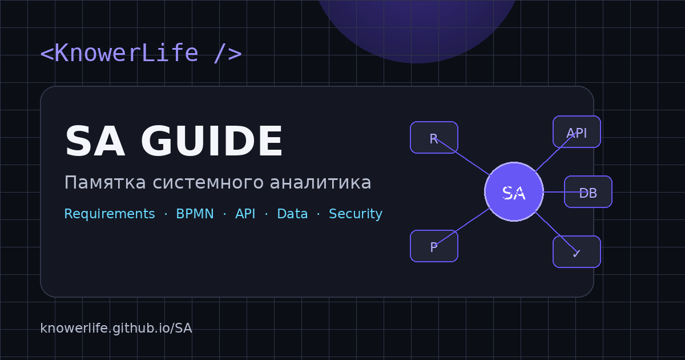

# SA Guide — System Analyst Essential Guide

[](https://knowerlife.github.io/SA/)
[](https://knowerlife.ru/)
[](https://knowerlife.github.io/SA/)
[](https://github.com/KnowerLife/SA)
[](LICENSE)

<p align="center">
  <a href="https://knowerlife.github.io/SA/">
    
  </a>
</p>

**SA Guide** — интерактивная база знаний и рабочая среда системного аналитика от **KnowerLife**.

Проект объединяет системный анализ, требования, процессы, API и интеграции, моделирование данных, безопасность, delivery, observability, документацию, карьерное развитие и набор локальных browser-инструментов для ежедневной работы аналитика.

🌐 **SA Guide:** https://knowerlife.github.io/SA/  
🌐 **KnowerLife:** https://knowerlife.ru/

---

## О проекте

SA Guide построен вокруг полного жизненного цикла аналитической задачи:

```text
DISCOVERY
   ↓
BUSINESS GOAL
   ↓
REQUIREMENTS
   ↓
PROCESS / DOMAIN
   ↓
API / EVENTS / DATA
   ↓
SECURITY / NFR
   ↓
IMPLEMENTATION
   ↓
TESTING
   ↓
RELEASE
   ↓
OBSERVABILITY
```

Это не только справочник с теорией. На одной странице объединены:

- структурированная база знаний;
- практические примеры;
- шаблоны аналитических артефактов;
- интерактивные чеклисты;
- калькуляторы;
- тестирование знаний;
- локальные заметки;
- risk management;
- traceability;
- архитектурные решения;
- API testing;
- PWA и offline-режим.

---

## 64 раздела знаний и инструментов

В SA Guide собраны основные области, с которыми системный аналитик сталкивается на реальных проектах.

### Discovery и требования

- Discovery;
- Problem Statement;
- бизнес-цели;
- Impact Mapping;
- Story Mapping;
- сбор и анализ требований;
- виды требований;
- функциональные требования;
- нефункциональные требования;
- жизненный цикл требования;
- baseline;
- Change Request;
- Impact Analysis;
- управление scope;
- приоритизация;
- MoSCoW;
- SMART;
- INVEST;
- Acceptance Criteria;
- Given / When / Then;
- трассировка требований.

### Процессы и моделирование

- BPMN;
- Use Cases;
- User Stories;
- UML;
- Sequence Diagram;
- State Diagram;
- Component Diagram;
- Deployment Diagram;
- C4 Context;
- C4 Container;
- DMN;
- decision tables;
- stakeholder analysis;
- Value vs Effort;
- Scrum;
- Kanban;
- Agile;
- Waterfall;
- CI/CD.

### API и архитектура

- API fundamentals;
- REST;
- SOAP;
- GraphQL;
- OpenAPI;
- resource design;
- HTTP methods;
- status codes;
- pagination;
- filtering;
- sorting;
- versioning;
- rate limits;
- request ID;
- correlation ID;
- архитектурные компромиссы;
- ADR;
- Domain-Driven Design;
- microservices.

### Интеграции и messaging

- synchronous integration;
- asynchronous integration;
- request / response;
- events;
- webhooks;
- polling;
- batch;
- SFTP;
- CDC;
- Kafka;
- RabbitMQ;
- topic;
- partition;
- consumer group;
- ordering;
- retention;
- replay;
- DLQ;
- poison messages.

### Надёжность интеграций

- timeout;
- retry;
- exponential backoff;
- jitter;
- idempotency;
- Circuit Breaker;
- Transactional Outbox;
- Saga;
- Dead Letter Queue;
- reconciliation.

### Данные

- relational databases;
- document databases;
- key-value;
- column-oriented databases;
- graph databases;
- search storage;
- ER-моделирование;
- SQL;
- нормализация;
- ACID;
- isolation levels;
- optimistic locking;
- pessimistic locking;
- strong consistency;
- eventual consistency;
- caching;
- TTL;
- invalidation;
- cache-aside.

### Безопасность

- authentication;
- authorization;
- OAuth 2;
- OpenID Connect;
- JWT;
- access token;
- refresh token;
- RBAC;
- ABAC;
- scopes;
- MFA;
- Threat Modeling;
- STRIDE;
- OWASP Top 10;
- требования к логированию и аудиту.

### Delivery и эксплуатация

- unit testing;
- integration testing;
- contract testing;
- E2E testing;
- performance testing;
- acceptance testing;
- backward compatibility;
- migration;
- rollback;
- feature flags;
- runbook;
- ownership;
- Logs;
- Metrics;
- Traces;
- Alerts;
- SLO;
- observability.

---

## Analyst Workbench

Отдельная часть SA Guide — интерактивная рабочая зона аналитика.

### Requirement Quality Checker

Проверяет формулировку требования на:

- неоднозначность;
- отсутствие измеримости;
- отсутствие субъекта;
- атомарность;
- тестируемость;
- наличие явной обязательности;
- признаки слабой формулировки.

Результат сопровождается score и конкретными замечаниями.

### Acceptance Criteria Builder

Позволяет быстро собрать сценарий:

```gherkin
Scenario: Подтверждение оплаты

Given заказ ожидает оплату
When пользователь подтверждает оплату
Then заказ переходит в статус paid
```

### SLA Calculator

Рассчитывает допустимый простой для заданного уровня доступности.

Пример:

```text
99.9% / 30 дней
→ 43 мин 12 сек допустимого простоя
```

### PERT Calculator

Работает с тремя оценками:

```text
Optimistic
Most likely
Pessimistic
```

и рассчитывает ожидаемую оценку и стандартное отклонение.

### HTTP Status Reference

Интерактивный справочник HTTP-кодов с поиском по:

- номеру;
- названию;
- назначению;
- типовым сценариям использования.

### Risk Matrix

Позволяет вести риски и рассчитывает:

```text
Risk Score = Probability × Impact
```

Риски автоматически сортируются по уровню критичности.

### Traceability Matrix

Связывает:

```text
Business Goal
→ Requirement
→ Acceptance / Test
```

Поддерживает локальное хранение и экспорт CSV.

### ADR / Decision Log

Рабочий журнал архитектурных решений:

- Decision;
- Status;
- Context;
- Consequences.

Поддерживает экспорт в Markdown.

---

## Дополнительные инструменты

SA Guide также включает:

- API Tester;
- SQL modeler;
- генератор `CREATE TABLE`;
- конвертер объёма данных;
- meeting timer;
- Decision Tree выбора процесса;
- тестирование знаний;
- локальные заметки;
- requirements checklist;
- security checklist;
- competency map;
- генератор SRS;
- User Story template;
- API Specification template;
- Test Case template;
- шаблоны рабочих сообщений;
- печать / сохранение в PDF средствами браузера.

---

## Навигация и UX

Большой объём информации организован так, чтобы SA Guide оставался рабочим инструментом, а не превращался в длинную энциклопедию.

### Быстрые маршруты

**Начинаю с задачи**

```text
Discovery → Requirements → Acceptance
```

**Проектирую интеграцию**

```text
API → Events → Reliability
```

**Проектирую данные**

```text
Model → Consistency → Cache
```

**Готовлю delivery**

```text
Security → Tests → Observability
```

### Возможности интерфейса

- полнотекстовый поиск;
- `Ctrl/⌘ + K` для перехода к поиску;
- `/` для быстрого поиска;
- категории разделов;
- локальные закладки;
- сохранение последнего прочитанного места;
- deep-link на каждый раздел;
- active section tracking;
- светлая и тёмная темы;
- увеличенный режим текста;
- mobile navigation через native `dialog`;
- адаптивная верстка;
- поддержка `prefers-reduced-motion`;
- крупные touch targets.

---

## PWA и offline

SA Guide является устанавливаемым Progressive Web App.

PWA включает:

- Web App Manifest;
- Service Worker;
- standalone-режим;
- offline fallback;
- app shell cache;
- runtime cache;
- отдельные `any` и `maskable` PWA-иконки;
- shortcuts к базе знаний, Workbench и API-разделу.

После первого посещения основные материалы могут оставаться доступными при нестабильном соединении.

---

## Приватность

Большая часть интерактивных данных обрабатывается только локально в браузере.

В `localStorage` могут сохраняться:

- тема;
- размер текста;
- закладки;
- последнее место;
- заметки;
- чеклисты;
- карта компетенций;
- Risk Matrix;
- Traceability Matrix;
- ADR.

SA Guide не требует собственного backend для этих функций.

> Для production-токенов, паролей, персональных данных и другой чувствительной информации следует использовать специализированные защищённые инструменты и корпоративные политики безопасности.

---

## Безопасность клиентского кода

В проекте исключены небезопасные или хрупкие способы динамической работы с DOM:

```text
eval()
document.write()
inline onclick
innerHTML assignment
```

Пользовательский контент выводится через DOM API и `textContent`.

Чтение JSON из `localStorage` выполняется через безопасный parser, поэтому повреждённое локальное состояние не должно блокировать загрузку интерфейса.

---

## Технологии

### Frontend

- Semantic HTML5;
- modern CSS;
- CSS Grid;
- Flexbox;
- CSS Custom Properties;
- responsive layout;
- Vanilla JavaScript;
- DOM API;
- Fetch API;
- AbortController;
- Clipboard API;
- Blob / URL API;
- Local Storage;
- Intersection Observer.

### PWA

- Web App Manifest;
- Service Worker;
- Cache Storage API;
- offline fallback.

### Hosting

- GitHub Pages;
- HTTPS;
- статическая архитектура без обязательного backend.

### Design system

SA Guide использует визуальную систему **KnowerLife**:

- `#6757f5` — основной violet;
- cyan accents;
- светлая и тёмная темы;
- системный sans-serif stack;
- моноширинная типографика для технических элементов;
- карточки, схемы и рабочие панели в общей стилистике KnowerLife.

---

## Структура проекта

```text
SA/
├── index.html
├── styles.css
├── script.js
├── sitemap.html
├── sitemap.xml
├── robots.txt
├── manifest.webmanifest
├── service-worker.js
├── offline.html
├── assets/
│   ├── favicon.svg
│   ├── icon-180.png
│   ├── icon-192.png
│   ├── icon-512.png
│   ├── icon-maskable-192.png
│   ├── icon-maskable-512.png
│   └── og-sa.png
├── scripts/
│   └── check_site.py
├── LICENSE
└── README.md
```

---

## Quality

SA Guide проверяется на уровне структуры и интерактивности.

Контролируется:

- уникальность HTML ID;
- наличие внутренних anchor targets;
- соответствие JS controls DOM-элементам;
- доступные имена form controls;
- отсутствие небезопасных JS-конструкций;
- наличие PWA-ресурсов;
- корректность manifest;
- JavaScript syntax;
- локальные asset references;
- мобильное горизонтальное переполнение.

Для актуальной версии проведён browser smoke на:

```text
1440 × 1000
768 × 1024
390 × 844
```

Проверялись:

- поиск;
- фильтры;
- мобильное меню;
- Requirement Checker;
- SLA Calculator;
- PERT Calculator;
- Risk Matrix;
- Traceability Matrix.

Результат:

```text
horizontal overflow = 0
console errors = 0
page errors = 0
```

---

## Экосистема KnowerLife

SA Guide является частью проектов **KnowerLife**.

- 🌐 [KnowerLife](https://knowerlife.ru/)
- 🧠 [SA Guide](https://knowerlife.github.io/SA/)
- 🛠️ [Browser Tools](https://knowerlife.ru/tools/)
- 🐙 [GitHub](https://github.com/KnowerLife)
- ✈️ [Telegram](https://t.me/knowerlife)
- 📘 [VK](https://vk.com/knowerlife)
- 📧 [info@knowerlife.ru](mailto:info@knowerlife.ru)

---

## Лицензия

Проект распространяется по лицензии **MIT**.  
Подробнее — в файле [LICENSE](LICENSE).

---

<p align="center">
  <strong>&lt;KnowerLife /&gt;</strong><br>
  System analysis · API · Integrations · Digital products
</p>
